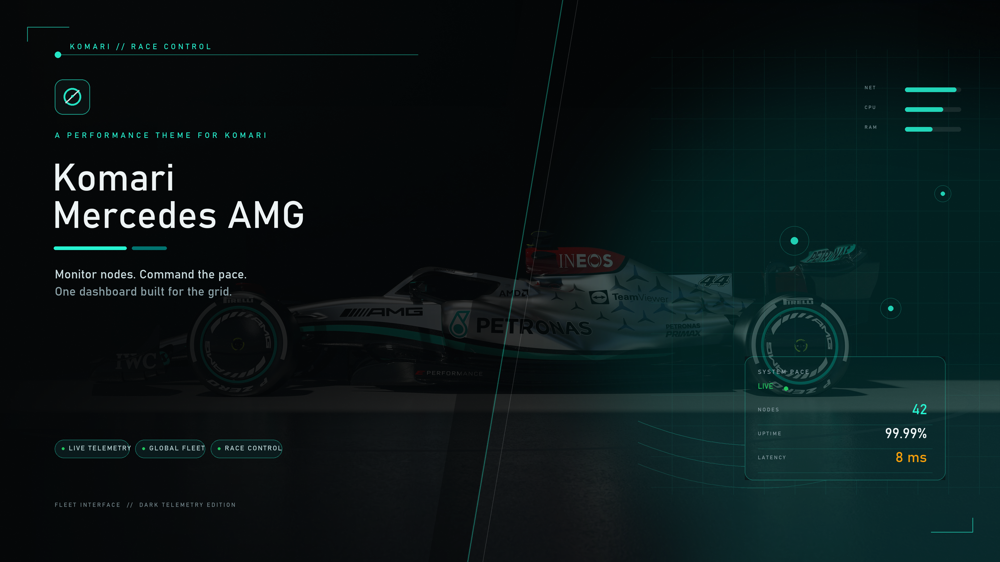
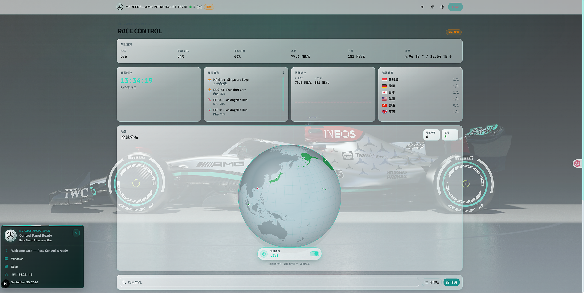
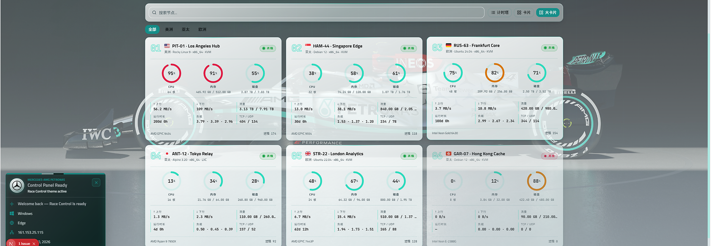

# 🏁 Komari Mercedes-AMG

<p align="center">
  
</p>

<p align="center">
  <strong>把冷冰冰的服务器探针，搬进 F1 围场围墙控制室 🏎️⚡</strong><br>
  经典马石油绿（Petronas Green）点缀 · 3D 全球轨道地球仪 · 计时塔梯队排位 · 极速实时遥测
</p>

<p align="center">
  <a href="README.md">🌐 English Documentation</a>
  ·
  <a href="https://github.com/JettHayes/Komari-Mercedes-AMG/releases/latest">📦 下载主题安装包</a>
  ·
  <a href="LICENSE">📜 CC BY-NC 4.0 许可协议</a>
</p>

---

## 🏎️ 设计理念与项目介绍

**Komari Mercedes-AMG** 是一套专为开源服务器监控面板 [Komari](https://github.com/komari-monitor/komari) 打造的深度定制第三方前端主题。

传统的服务器监控面板大多是千篇一律的折线与卡片堆叠，而我们选择用赛道控制室的工程视角重构这套界面：

- **AMG 遥测美学**：采用银箭经典灰黑磨砂玻璃背景，辅以标志性的马石油青绿高光脉冲。
- **排位计时塔（Timing Tower）**：把分散在世界各地的 VPS 与独立主机视作赛道上的赛车车队，按状态和权重严密排位。
- **内置离线演练（Mock Fleet）**：本地没有搭 Komari 后端也能立刻预览完整动态车队和指标，开箱即见效果。

> 💡 **项目说明**：本仓库为纯前端主题层，不包含监控 Agent 与后端收集程序。您可以直接下载主题 zip 上传至 Komari 管理面板使用。

---

## 📊 界面预览

### 🏁 赛道控制室全景（Overview）

车队全局 KPI、实时告警看板、全球卫星落点地球仪与计时塔阵列一屏统揽：

<p align="center">
  
</p>

<br>

### 📈 赛车单机深度遥测（Telemetry & Ping）

点入单台节点即可查阅专属规格铭牌、毫秒级网络时延与高精度历史负载走势：

<p align="center">
  
</p>

---

## ✨ 核心模块一览

| 模块 | 功能说明 | 特色体验 |
| :--- | :--- | :--- |
| ⏱️ **赛事时钟（Session Clock）** | 现场基准时钟与状态心跳提示 | 消除传统面板静态呆板感 |
| 🏎️ **车队核心指标（Fleet KPI）** | 节点在线率、平均算力负荷、全局瞬时吞吐 | 顶部紧凑状态条，一眼掌握集群健康度 |
| ⚠️ **赛事控制告警（Race Control Alerts）** | 节点失联断连、临期到期自动预警置顶 | 告别隐蔽报错，红黄旗状态一览无余 |
| 🌐 **3D 轨道地球仪（Interactive Globe）** | 节点地理空间分布与光柱标记 | 支持拖拽旋转探索、悬停暂停、实时对位 |
| 🏆 **计时塔节点墙（Timing Tower）** | 提供大卡片、小卡片、经典排位列表三种密度 | 适应从手机横竖屏到 4K 带宽大屏展示 |
| 💱 **剩余价值与到期计算** | 汇率换算与服务器持有残值自动推导 | 方便管理和统计海内外云资产续费成本 |

---

## 🚀 极速安装与部署

### 方式 A：直接上传预编译包（推荐小白使用）

1. 从 [Releases 页面](https://github.com/JettHayes/Komari-Mercedes-AMG/releases/latest) 下载最新版本的打包成品（`.zip` 文件）。
2. 登录您的 Komari 后台，进入 **「设置」→「主题」** 面板。
3. 点击上传刚刚下载的主题 zip 包，并选择启用 **Komari-Mercedes-AMG**。
4. 刷新首页，即刻感受围场控制室带来的震撼视觉。

> ⚠️ **注意**：请勿直接使用 GitHub 页面自动生成的 *Source code (zip)*，该源码包未经静态编译，无法被 Komari 直接识别。

---

### 方式 B：本地开发与自主构建

如果您希望对主题颜色、布局或动效做自定义修改：

#### 1. 前置准备
- **Node.js** 22.0 或更高版本
- 本地包管理器：`npm` / `pnpm`

#### 2. 本地调试
```bash
# 1. 安装项目依赖
npm install

# 2. 启动本地开发服务
npm run dev
```
启动后在浏览器打开 `http://localhost:3000`。
- 如果本地未连接真实后端，系统会自动激活 **演示车队模式（Demo Data）**，供您随意测试和调整 UI。
- 如需直连您自建的 Komari 线上后端，在项目根目录新建 `.env.local` 即可：
  ```env
  NEXT_PUBLIC_API_TARGET=http://你的服务器IP或域名:25774
  ```

#### 3. 编译打包出自己的主题
```bash
# 执行静态构建
npm run build
```
编译成功后，产物会输出在 `dist/` 目录，将其与根目录的 `komari-theme.json` 和 `preview.png` 打包为 zip 即可。

---

## ⚙️ 主题专属配置项

管理员可在 Komari 后台对主题进行精细化微调，访客亦可在前端本地记住偏好：

- 🎨 **外观模式**：自由在暗黑战甲（Dark）与浅色工程（Light）之间切换。
- 🗂️ **计时塔排布**：支持大卡片（Large）、紧凑卡片（Grid）、清单模式（Table）或自适应。
- 🌍 **全球落点模块**：可自由开关 3D 地球仪、区域分布卡片与速度走势。
- 🔒 **访客隐私保护**：自主决定是否对未登录访客公开主机价格、剩余价值和到期倒计时。

---

## 🛠️ 技术底座

- **架构核心**：Next.js (App Router, Static Export 静态导出)
- **语言标准**：TypeScript 5.x + React 19
- **样式方案**：Tailwind CSS v4 + 专属玻璃拟态原子设计
- **组件支撑**：Radix UI + Shadcn UI Primitives
- **动效图表**：Recharts + D3-Geo 投影 + 专属交互引擎
- **接口通讯**：高鲁棒性 JSON-RPC 2.0 (WebSocket / HTTP 双模支持)

---

## 📜 许可协议（License）

本项目采用 **[CC BY-NC 4.0 (知识共享-署名-非商业性使用 4.0 国际许可协议)](LICENSE)** 发布：

- ✅ **您可以自由**：阅读源码、Fork 项目、个人搭建使用或用于非商业性研究学习。
- ❌ **严禁以下行为**：禁止任何人或组织将本项目用于商业牟利、打包转售或集成进商业付费产品。

> Copyright (c) 2026 **Jett Hayes** ([GitHub @JettHayes](https://github.com/JettHayes/Komari-Mercedes-AMG))
